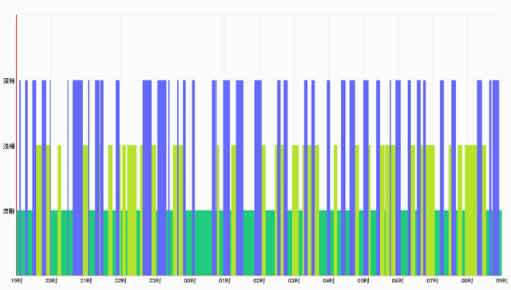

# Android根据百分比填充颜色图表
Android 通过百分比填充指定颜色的图表，可以自定义横坐标、纵坐标的标签，文字颜色，字体大小等；同时指定是否需要绘制网格线，是否需要绘制动画等。

## 效果

## 自定义属性

    <!--按百分比填充颜色分配图表-->
    <declare-styleable name="PercentChartView">
        <!--x 轴方向标签高度-->
        <attr name="x_labelsHeight" format="dimension" />
        <!--x 轴标签名距离x轴的距离-->
        <attr name="x_labelPadding" format="dimension" />
        <!--x 方向偏移量，用于保证文字居中，最后边一个文字也不会偏移出控件范围-->
        <attr name="x_offsetWidth" format="dimension" />

        <!--y 轴方向标签宽度-->
        <attr name="y_labelsWidth" format="dimension" />
        <!--y 轴标签名距离x轴的距离-->
        <attr name="y_labelPadding" format="dimension" />
        <!--y 方向偏移量，用于保证文字居中，最后边一个文字也不会偏移出控件范围-->
        <attr name="y_offsetHeight" format="dimension" />

        <!--是否绘制x方向网格线-->
        <attr name="isDrawXGrid" format="boolean" />
        <!--x轴线宽度-->
        <attr name="x_axisWidth" format="dimension" />
        <!--x轴线颜色-->
        <attr name="x_axisColor" format="color" />
        <!--x轴方向网格线宽度-->
        <attr name="x_gridWidth" format="dimension" />
        <!--x轴方向网格线颜色-->
        <attr name="x_gridColor" format="color" />

        <!--是否绘制y方向网格线-->
        <attr name="isDrawYGrid" format="boolean" />
        <!--y轴线宽度-->
        <attr name="y_axisWidth" format="dimension" />
        <!--y轴线颜色-->
        <attr name="y_axisColor" format="color" />
        <!--y轴方向网格线宽度-->
        <attr name="y_gridWidth" format="dimension" />
        <!--y轴方向网格线颜色-->
        <attr name="y_gridColor" format="color" />

        <!--x 轴上标签文字大小-->
        <attr name="x_labelSize" format="dimension" />
        <!--x 轴上标签文字颜色-->
        <attr name="x_labelColor" format="color" />

        <!--y 轴上标签文字大小-->
        <attr name="y_labelSize" format="dimension" />
        <!--y 轴上标签文字颜色-->
        <attr name="y_labelColor" format="color" />

        <!--是否需要动画，默认需要-->
        <attr name="is_need_animation" format="boolean" />
        <!--动画时长，默认 1200 毫秒-->
        <attr name="animation_duration" format="integer" />
    </declare-styleable>

当然这些属性也可以在代码中动态设置，都有相对应的  `setXxx` 和 `getXxx` 方法。